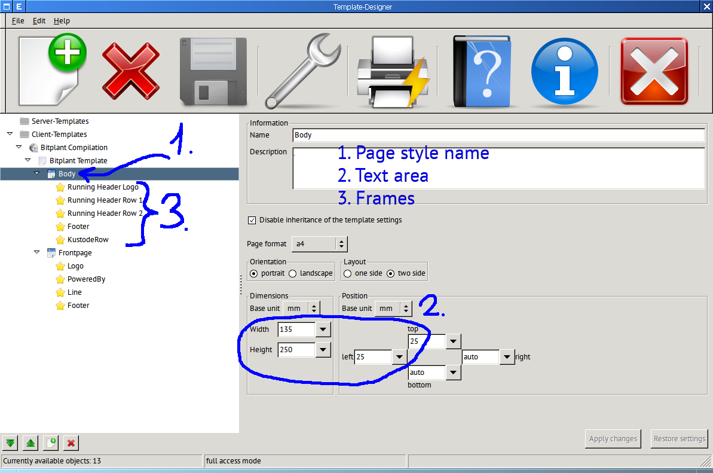
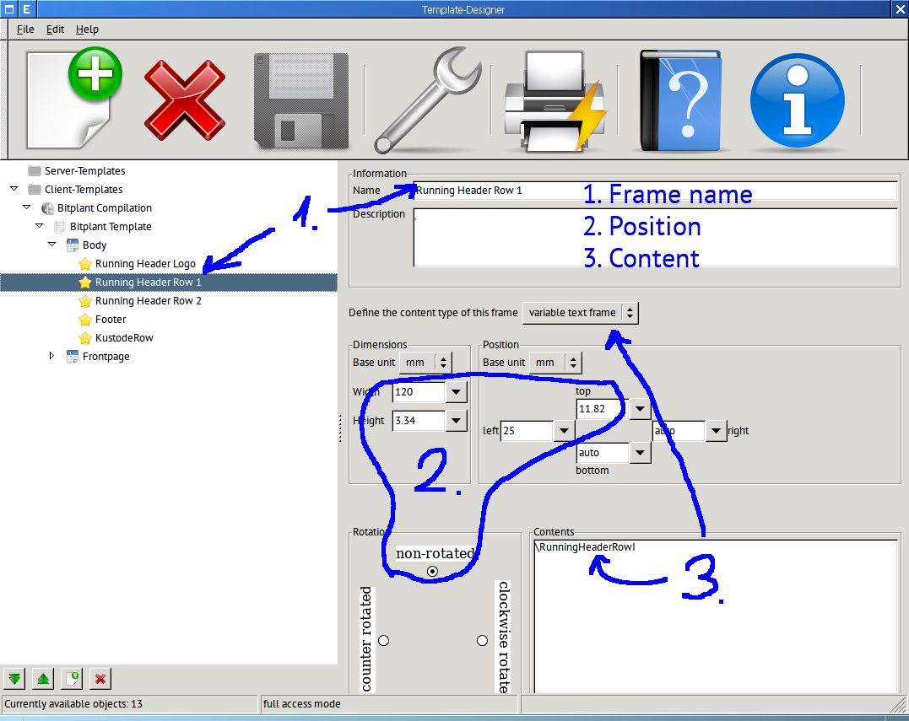

# Template designer

Template-Designer is a utility to create page template definitions
which are ready to convert to XSL-FO or TeXML

## The page style window

The screenshot of the page style window shows:

* One collection with two page styles, `Body` and `Frontpage`.
* The page style `Body` has the text area of width 135mm and height 250 mm, which top-left corner is located at (25mm, 25mm).
* The page style `Body` has several frames.

## The frame window

The screenshot of the frame window show:

* The name of the current frame is `Running Header Row 1`, the frame belongs to the page style `Body`.
* The width of the frame is 120mm and the height is 3.34mm, the top-left cornet is located at (25mm,11.82mm).
* The content of the frame is generated by the LaTeX command `RunningHeaderRowI`.

## Installation and fast start

1. Unpack the distribution package and run the file `templatedesigner.sh` (Linux) or `templatedesigner.bat` (Windows).
  * The program starts if the prerequisites are installed.
  * The program creates the directory `~/Library/Template-Designer` (Linux) or `My Documents\Template-Designer` (Windows).
2. Exit the program.
3. Copy the example `bitplantbook.xml` and `images` into the subdirectory `client` of the just created directory.
4. Start the program again.
  * Now you can play with the example.
6. Use the tool Template Converter to make a `.sty`-file for LaTeX from a result of Template Designer.

The prerequisites are:

* Python 2.X.
* [wxPython](http://www.wxpython.org/)
* [Python Imaging Library (PIL)](http://www.pythonware.com/products/pil/)
* GhostScript, if you are going to create image frames and the images are not in PNG format.

## Usage

The interface of Template Designer is mostly intuitive. Therefore, only non-obvious issues are commented here.

The name of the file changes on each save. For me it is inconvenient and therefore, I do not store the template files in the `Template-Designer` directory. Instead, I have a special directory `stable_templates`. When I want to change a template, I copy its file from `stable_templates` to `Template-Designer`. Time to time I copy a current version back to the `stable_templates`.

At the moment, only the page sizes `A4`, `A5` and `letter` are supported by Template Converter. Fortunately, it is easy to add support for other sizes.

----------

Oleg Parashchenko,
[bitplant.de GmbH](http://www.bitplant.de/)
